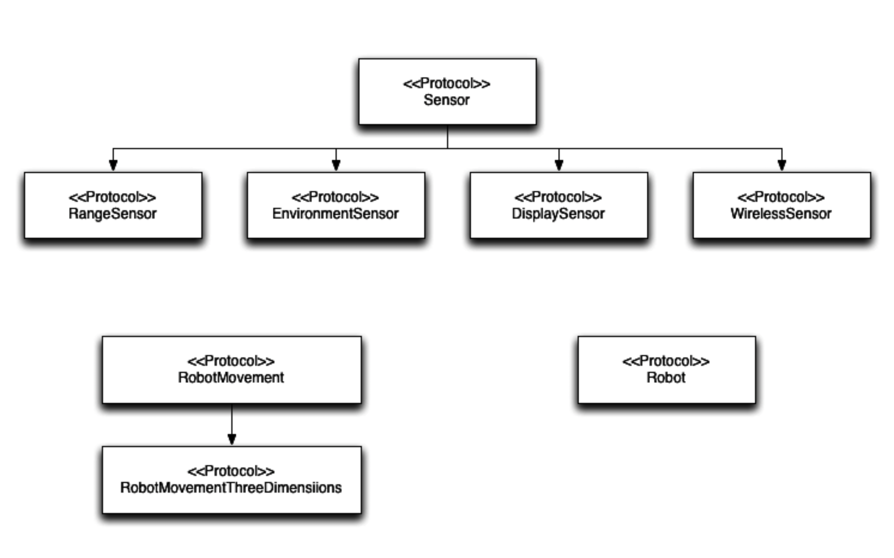

# Designing with Protocol 


```swift

protocol RobotMovement {
    func forward(speedPercent:Double)
    func backward(speedPercent:Double)
    func left(speedPercent:Double)
    func right(speedPercent:Double)
    func stop()
}


protocol RobotMovmentThreeDimension:RobotMovement {
    func up(speedPercent:Double)
    func down(sppedPercent:Double)
}

protocol Sensor {
    var sensorType: String {get}
    var sensorName: String {get set}
 
    init (sensorName: String)
    func pollSensor()
}

protocol EnvironmentSensor:Sensor {
    func currentTemperature() ->Double
    func currentHumidity() ->Double
}

protocol RangeSensor: Sensor {
    func setRangeNotification(rangeCentimeter: Double,rangeNotification: () -> Void)
    func currentRange() -> Double
}
 
protocol DisplaySensor: Sensor {
    func displayMessage(message: String)
}
 
protocol WirelessSensor: Sensor {
    func setMessageReceivedNotification(messageNotification: (String) -> Void)
    func messageSend(message: String)
}

protocol Robot {
    
    var name:String { get set }
    var robotMovement:RobotMovement { get set }
    var sensors : [Sensor] { get }
    init(name:String ,robotMovement: RobotMovement)
    func addSensor(sensor:Sensor)
    func pollSensor()
    
}

```

The following diagram shows the protocols that we just defined with the protocol hierarchy

